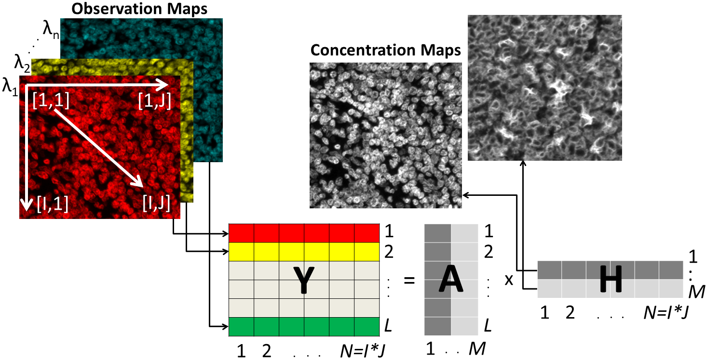

# Blind_Unmixing_NMF_RI

This repository contains the official MATLAB implementation of:

**NMF-RI: Blind spectral unmixing of highly mixed multispectral flow and image cytometry data.**  
Daniel Jiménez-Sánchez*, Mikel Ariz*, José Mário Morgado, Iván Cortés-Domínguez, Carlos Ortiz-de-Solórzano. https://academic.oup.com/bioinformatics/advance-article/doi/10.1093/bioinformatics/btz751/5583734  (*: equal contribution)

contact: codesolorzano@unav.es



**Abstract:**

**Motivation**
Recent advances in multiplex immunostaining and multispectral cytometry have opened the door to simultaneously visualizing an unprecedented number of biomarkers both in liquid and solid samples. Properly unmixing fluorescent emissions is a challenging task, which normally requires the characterization of the individual fluorochromes from control samples. As the number of fluorochromes increases, the cost in time and use of reagents becomes prohibitively high. Here we present a fully-unsupervised blind spectral unmixing method for the separation of fluorescent emissions in highly mixed spectral data, without the need for control samples. To this end, we extend an existing method based on Non-negative Matrix Factorization, and introduce several critical improvements: initialization based on the theoretical spectra, automated selection of ‘sparse’ data and use of a re-initialized multi-layer optimizer.

**Results**
Our algorithm is exhaustively tested using synthetic data to study its robustness against different levels of colocalization, signal to noise ratio, spectral resolution, and the effect of errors in the initialization of the algorithm. Then we compare the performance of our method to that of traditional spectral unmixing algorithms using novel multispectral flow and image cytometry systems. In all cases, we show that our blind unmixing algorithm performs robust unmixing of highly spatially and spectrally mixed data with an unprecedently low computational cost. In summary, we present the first use of a blind unmixing method in multispectral flow and image cytometry, opening the door to the widespread use of our method to efficiently pre-process multiplex immunostaining samples without the need of experimental controls.

### Requirements
* Pytorch 0.2 (0.3 breaks simulation decoder)
* Python 2.7 or 3.6

### Data generation

To replicate the experiments on simulated physical data, first generate training, validation and test data by running:

```
cd data
python generate_dataset.py
```
This generates the springs dataset, use `--simulation charged` for charged particles.

Note: Make sure to use the same preprocessing and evaluation scripts (check the loss function as well) as in our code release to get comparable results.

### Run experiments

From the project's root folder, simply run
```
python train.py
```
to train a Neural Relational Inference (NRI) model on the springs dataset. You can specify a different dataset by modifying the `suffix` argument: `--suffix charged5` will run the model on the charged particle simulation with 5 particles (if it has been generated).

To train the encoder or decoder separately, run 

```
python train_enc.py
```
or

```
python train_dec.py
```
respectively. We provide a number of training options which are documented in the respective training files.

Additionally, we provide code for an LSTM baseline (denoted *LSTM (joint)* in the paper), which you can run as follows:
```
python lstm_baseline.py
```

### Cite
If you make use of this code in your own work, please cite our paper:
```
@article{kipf2018neural,
  title={Neural Relational Inference for Interacting Systems},
  author={Kipf, Thomas and Fetaya, Ethan and Wang, Kuan-Chieh and Welling, Max and Zemel, Richard},
  journal={arXiv preprint arXiv:1802.04687},
  year={2018}
}
```
